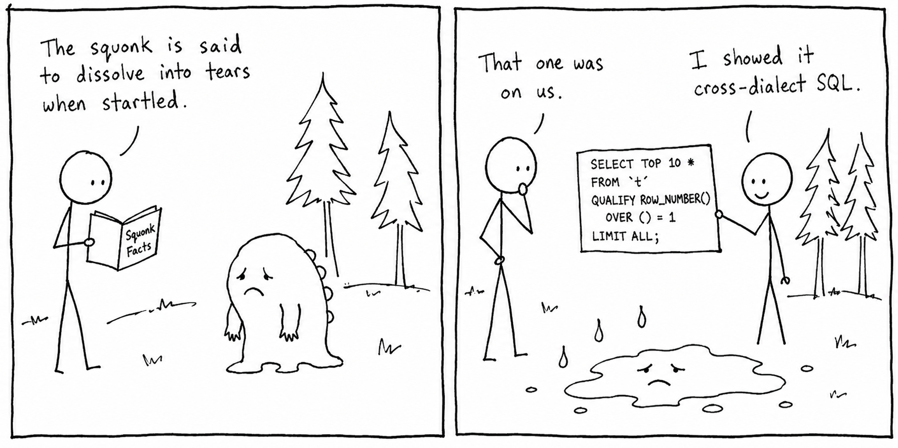

# squonk

A fast, compact, and standards-minded library for parsing, rendering, transforming, and analysing SQL.



## Why another SQL parser?

The [`sqlparser`](https://crates.io/crates/sqlparser) crate, maintained in the [`datafusion-sqlparser-rs`](https://github.com/apache/datafusion-sqlparser-rs) repository, is a mature and widely used SQL parser for Rust. `squonk` addresses the same problem with a different architecture: declarative dialects, a compact owned AST, and conformance testing against real database engines.

Dialect behaviour is defined through a trait with 184 overridable methods. As a result, each dialect becomes a patchwork of code overrides that is difficult to inspect, compare, and extend. Its allocation-heavy AST also keeps parsing among DataFusion’s identified performance opportunities.

`squonk` approaches the problem differently:

* Dialects are data, not subclasses.
* The AST is owned, compact, and designed for long-lived tooling.
* Engine-backed dialects are tested against the engines themselves, not just against our expectations

## What makes it useful?

* **Dialects are data.** An attempt to create a common feature based spec has been made, users and contributors can inspect a dialect, compare two presets field by field, or define a custom dialect as a small delta instead of forking parser code.
* **The AST is built for tooling.** Every node is owned, `'static`, and includes a byte span and stable node ID. Trees can be stored, sent across threads, and mapped back to the exact source bytes.
* **Errors are structured, and recovery is built in.** A recovering parse preserves valid statements while reporting invalid ones with locations and diagnostics. One malformed query does not get to ruin everyone else’s day.
* **Rendering understands context.** Produce canonical, fully parenthesized, or PII-redacted SQL; render for a target dialect; or transpile between dialects in one call.
* **The default dependency tree is tiny.** The Rust crate depends on one micro-dependency, `thin-vec`. Serde support is optional, keeping compile times and supply-chain surface pleasantly boring.
* **Rust, Python, and TypeScript share one core.** Every language surface parses SQL using the same implementation, avoiding subtle differences between bindings.

The full subsystem and statement inventory lives in [docs/architecture.md](./docs/architecture.md). Design decisions are recorded in [docs/adr/](./docs/adr/).

## Quick start

### Rust

Add `squonk` with Cargo:

```sh
cargo add squonk
```

```rust
use squonk::parse;

let parsed = parse("select 1 +  2").expect("well-formed SQL parses");

assert_eq!(parsed.to_string(), "SELECT 1 + 2");
```

The default build includes only the ANSI dialect. Other native dialects are enabled through Cargo features; see [Feature flags](#feature-flags).

### Python

```sh
pip install squonk
```

```python
import squonk as sql

doc = sql.parse(
    "select salary from employees",
    dialect="ansi",
)

assert doc.to_sql() == "SELECT salary FROM employees"

idents = [ident.text for ident in doc.find_all(sql.Ident)]
```

The Python API also supports recovering parses, structured diagnostics, tokenization with optional trivia, rendering, redaction, and transpilation.

See [crates/squonk-python](./crates/squonk-python/README.md).

### TypeScript

```sh
npm install @squonk-sql/postgres
```

```ts
import { parse } from "@squonk-sql/postgres";

const doc = parse("select id, name from users where id = $1");

console.log(doc.toSQL());
```

Node and Bun expose a synchronous API backed by a prebuilt Node-API engine, with automatic WASM fallback when addons are unavailable. Deno and Workers receive permissionless runtime-specific WASM entrypoints. Browsers use the explicit async factory from `@squonk-sql/postgres/browser`. Focused `@squonk-sql/*` packages retain dialect-gated APIs and dialect-sized WASM artifacts; the unscoped `squonk` package includes every built-in dialect.

The parser is pure Rust, so building it does not require a C toolchain.

See [crates/squonk-wasm](./crates/squonk-wasm/README.md).

## Correctness

Parsers should not grade their own homework.

Engine-backed dialects are tested against the engines they claim to support:

* PostgreSQL through [`libpg_query`](https://github.com/pganalyze/libpg_query), running in process
* SQLite and DuckDB through their embedded engines
* MySQL through a running server

The test corpus includes regression suites vendored from those projects. CI pins exact conformance counts and follows one hard rule: `squonk` must not accept SQL that the reference engine rejects. Pins move only after fresh measurements.

Additional coverage includes:

* property-based tests
* cross-dialect fuzzing
* round-trip checks requiring parse, render, and reparse operations to produce the same structure

Dialects without a full engine oracle—such as Snowflake, Databricks, and Redshift—use deliberately conservative presets. Every enabled feature must cite the engine’s documentation rather than rely on optimistic guesswork.

Partial or comparison-based oracles are labelled clearly. ClickHouse is checked with `clickhouse local`, while BigQuery is cross-checked against sqlglot.

Each dialect’s support tier and source of truth are listed in [docs/support-tiers.md](./docs/support-tiers.md).

## Performance

The publication benchmark measures one operation: parsing the same frozen SQL into a
complete AST through each tool's public API. Results are compared within an ecosystem so
language-runtime costs are not mistaken for parser-core differences.


On the controlled Linux snapshot, Rust Squonk delivered **2.37×** the full-AST throughput
of `datafusion-sqlparser-rs`. Through the Python and Node APIs it delivered **0.61×** and
**0.25×** the throughput of sqlglot and `node-sql-parser`, respectively. Those binding
measurements include materializing Squonk documents with source spans and node IDs; they are
product costs, not Rust-core measurements.

Why this metric is useful, which comparisons are valid, cold-start and retained-memory
results, uncertainty, limitations, and the raw observations are documented in
[docs/performance.md](./docs/performance.md).

## Feature flags

The default build includes only ANSI and depends on `thin-vec`. Everything else is opt-in:

* `postgres`, `mysql`, `sqlite`, `duckdb` — engine-verified dialects
* `bigquery`, `clickhouse`, `databricks`, `hive`, `mssql`, `redshift`, `snowflake` — documentation-backed or partially verified presets; see [support tiers](./docs/support-tiers.md)
* `lenient` — a permissive union dialect for parse-almost-anything workloads
* `full` — all dialect features listed above
* `serde` — AST serialization and deserialization
* `serde-serialize` — serialization only
* `serde-deserialize` — deserialization only

## Platform support

The `cargo add`, `pip install`, and `npm install` examples are intentionally operating-system neutral.

Actual support levels—fully tested, compile-verified, or best effort—are defined in [docs/platform-support.md](./docs/platform-support.md). Every promised tier has a corresponding CI check.

The squonk may be elusive. Platform guarantees should not be.

## Safety and MSRV

The AST crate, `squonk-ast`, declares:

```rust
#![forbid(unsafe_code)]
```

This is a compiler-enforced rule that cannot be overridden within the crate.

The parser crate and the rest of the workspace use:

```rust
#![deny(unsafe_code)]
```

The workspace contains no unsafe code today. Using `deny` outside the AST crate leaves room for a narrow, reviewed `#[allow(unsafe_code)]` block if a future performance-critical path genuinely requires one.

The default build’s sole dependency, `thin-vec`, is the only vetted crate containing internal `unsafe`.

The minimum supported Rust version is **1.85**. It is declared through `rust-version` in the workspace manifest and verified in CI, preventing accidental version drift.

## Contributing

We welcome focused issues and pull requests. Please read [CONTRIBUTING.md](CONTRIBUTING.md)
before starting a substantial change, or contact us at
[opensource@moderately.ai](mailto:opensource@moderately.ai).

Send security-related reports directly to [security@moderately.ai](mailto:security@moderately.ai).

All project interaction is governed by our [Code of Conduct](CODE_OF_CONDUCT.md). Conduct concerns may be reported to [opensource@moderately.ai](mailto:opensource@moderately.ai).

Before requesting a new dialect or syntax feature, read the [dialect and syntax request policy](docs/dialect-requests.md). It explains the initial support tier for new dialects and the engine or documentation evidence required for a request.

For everything else:

* [SUPPORT.md](SUPPORT.md) explains where questions, bugs, and reports belong.
* [SECURITY.md](SECURITY.md) explains how to report vulnerabilities.

## Sponsors

`squonk` is maintained and sponsored by Moderately AI Inc.

To discuss sponsorship, contact [opensource@moderately.ai](mailto:opensource@moderately.ai).

## Acknowledgements

No parser appears from nowhere. This project builds on prior work and draws much of its test surface from the engines themselves:

* [`datafusion-sqlparser-rs`](https://github.com/apache/datafusion-sqlparser-rs) — the primary prior art, a source of lessons, and the benchmark reference
* [`libpg_query`](https://github.com/pganalyze/libpg_query), through [`pg_query.rs`](https://github.com/pganalyze/pg_query.rs) — PostgreSQL’s extracted parser, our PostgreSQL differential oracle, and our first-party performance comparison
* [PostgreSQL](https://www.postgresql.org/), [MySQL](https://www.mysql.com/), [SQLite](https://sqlite.org/), and [DuckDB](https://duckdb.org/) — their engines act as conformance oracles, and their regression suites provide the corpora we vendor and test against

## License

Licensed under the [MIT License](./LICENSE).
