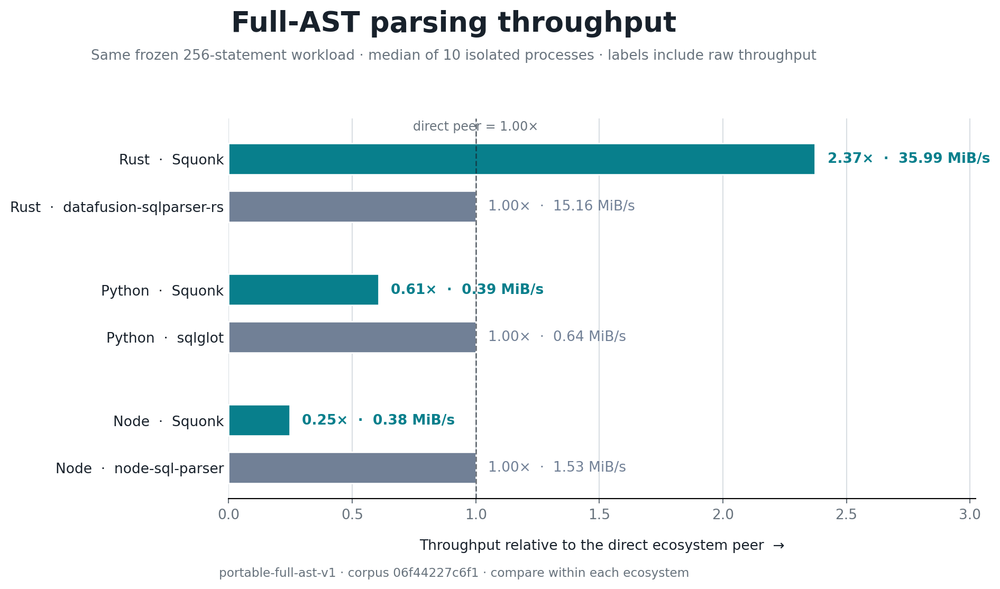

# Performance

This document describes what the performance suite measures, why each metric exists, which
tools can be compared for that metric, and what the current measurements show. The raw
publication result is
[`bench/publication/results/headline.json`](../bench/publication/results/headline.json).

## Questions

The publication suite asks three separate questions:

1. How much SQL can each public API parse into complete ASTs after warm-up?
2. How long does a fresh process take to load the parser and parse once?
3. How much additional resident memory is associated with retaining parsed documents?

These metrics describe compute, startup, and retained state. None is a correctness score or
a complete definition of parser quality. Dialect coverage, diagnostics, source fidelity,
AST contents, and transformation APIs are separate product properties.

## What constitutes a comparison

A measured tool must parse the same frozen input into a traversable AST. Tokenizers,
formatters, validators, and database execution engines do different work and are excluded.
The suite uses one direct alternative in each shipped language ecosystem:

| Ecosystem | Squonk surface | Direct alternative | Comparison boundary |
| --- | --- | --- | --- |
| Rust | `squonk` with `Ansi` | `datafusion-sqlparser-rs` with `AnsiDialect` | Native owned AST returned by each Rust library |
| Python | `squonk==1.0.0` | `sqlglot==30.12.0` | Installed package returns its public Python document/AST |
| Node | `@squonk-sql/ansi@1.0.0` | `node-sql-parser==5.4.0` | Installed package returns its public JavaScript document/AST |

`node-sql-parser` has no ANSI mode, so it uses its MySQL grammar. This does not change the
workload: all statements were frozen first and independently accepted by MySQL as well as
the other stable oracles.

Comparisons are interpreted within an ecosystem. Rust, CPython, and Node have different
runtime, allocation, garbage-collection, and binding costs, so an absolute value from one
ecosystem is not an algorithmic ranking against a value from another.

Some other tools appear in specialized development benchmarks but not this table:

- `libpg_query` exposes PostgreSQL's C parse tree rather than the same retained owned-AST
  contract. It is useful for PostgreSQL-specific instruction studies, not the portable
  public-API comparison.
- SQL formatters and tokenizers do not construct comparable ASTs.
- Database engines qualify syntax; they are not embeddable parser-library peers.
- JVM parsers require a separate design that accounts for VM startup and JIT state.

## Workload

[`portable-full-ast-v1`](../bench/publication/corpus/portable.json) contains 256 statements
and 26,102 UTF-8 input bytes:

| Statement family | Count |
| --- | ---: |
| Query | 144 |
| DML | 64 |
| DDL | 48 |

The corpus also contains 64 cases in each of four predetermined complexity bands. It is
self-authored, MIT-licensed, identified by SHA-256
`06f44227c6f1566b7caaa43362e89c91ade96d5533a70b846f77c6178739b0a6`, and frozen before
competitor qualification.

The permanent conformance test requires every statement to be accepted by Squonk ANSI,
PostgreSQL 17 through `libpg_query`, MySQL 8.4.10, SQLite 3.53.2, and DuckDB 1.5.4. Each of
the six measured adapters then accepted 256/256. A tool that rejects a statement is marked
unqualified; the suite never intersects the corpus down to a more favorable subset.

Oracle acceptance establishes that this is a portable workload. It is not plotted as a
metric because every qualified tool has the same denominator and acceptance is not evidence
of broader dialect completeness.

## Metric 1: warm full-AST throughput

### Why measure it

Warm throughput matters when a process parses many statements: static analysis, migration
tools, lineage extraction, query review, and batch ingestion. The work unit includes parsing
and constructing the complete public AST/document returned to the caller. It excludes SQL
rendering, serialization, and later transformations.

### Why these tools are comparable

Within each ecosystem, both tools consume identical strings and return their normal public
AST representation. The Rust pair is the closest parser-core comparison because both sides
remain native Rust. Python and Node intentionally include Squonk's binding conversion and
the peer's runtime-native object construction. Those are real public-API costs even though
the returned representations do not contain identical metadata.

### Method

Each independent process warms for two seconds, calibrates enough whole-corpus passes to run
for at least one second, and records seven samples. The reported value is the median of ten
independent process medians. Processes are scheduled in deterministically randomized blocks
across all six tools. The controller and children are pinned to one logical CPU.

MiB/s is used instead of statements/s because statement sizes differ; statements/s remains
available in the raw result. A series is reportable only when the coefficient of variation
across process medians is no greater than 5%.

### Results

| Ecosystem | Parser | Median MiB/s | 95% bootstrap interval | Process CV | Relative to peer |
| --- | --- | ---: | ---: | ---: | ---: |
| Rust | Squonk | 35.99 | 35.81–36.05 | 0.45% | **2.37×** |
| Rust | datafusion-sqlparser-rs | 15.16 | 15.06–15.30 | 1.03% | 1.00× |
| Python | Squonk | 0.39 | 0.385–0.393 | 3.86% | **0.61×** |
| Python | sqlglot | 0.64 | 0.621–0.649 | 3.19% | 1.00× |
| Node | Squonk | 0.38 | 0.376–0.384 | 1.33% | **0.25×** |
| Node | node-sql-parser | 1.53 | 1.526–1.543 | 0.85% | 1.00× |

The result supports a narrow claim: on this workload and host, the Rust library processed
input 2.37 times as quickly as its direct Rust peer. The Python and Node Squonk packages had
lower warm throughput than their direct peers.

Squonk's binding results include construction of documents that carry source text, byte
spans, stable node IDs, and the cross-language representation. The comparison does not
subtract that work because users pay for it. It also means the Python and Node ratios must
not be presented as measurements of the Rust parser core alone.



## Metric 2: cold-start latency

### Why measure it

Cold start matters for command-line programs, serverless handlers, build hooks, and short
scripts that may parse only once. A warm throughput loop cannot answer this question.

### Why these tools are comparable

Within an ecosystem, the controller starts a fresh process and invokes the installed public
package or compiled adapter. The measurement includes process launch, module loading,
parser initialization, and the first successful parse. Cross-ecosystem comparisons remain
descriptive because starting a native executable, CPython, and Node are different operations.

### Results

| Ecosystem | Parser | Median ms | 95% bootstrap interval |
| --- | --- | ---: | ---: |
| Rust | Squonk | 2.35 | 2.29–2.57 |
| Rust | datafusion-sqlparser-rs | 2.44 | 2.41–2.47 |
| Python | Squonk | **36.30** | 36.17–36.51 |
| Python | sqlglot | 75.57 | 75.34–76.29 |
| Node | Squonk | **45.93** | 45.78–46.61 |
| Node | node-sql-parser | 112.59 | 112.30–114.08 |

Rust startup was similar for the two parsers. The Squonk packages started and completed a
first parse sooner than their Python and Node peers on this host. This does not offset or
combine with warm throughput; it answers a different workload question.

## Metric 3: incremental retained memory

### Why measure it

Long-lived tools may retain thousands of parsed documents. Their relevant memory cost is
the incremental cost of keeping AST roots live, not only the peak allocation of one parse.

### Why these tools are comparable

Within one runtime, the adapter retains increasing numbers of complete public roots while an
external controller measures resident set size. Regressing RSS against retained-document
count removes the fixed process intercept and estimates bytes per additional document.

The resulting slopes are not compared across Rust, Python, and Node. Runtime allocators,
garbage collectors, object headers, and binding representations differ even after the fixed
intercept is removed. The representation contents also differ between products, so the
metric describes product memory cost rather than equal-size semantic payloads.

### Method and reporting rule

Counts are randomized within each of three repetitions and doubled until the signal is at
least 128 MiB or reaches 8,192 documents. Each repetition receives its own linear fit.
Results are reportable when slope CV is no greater than 10% and every fit has R² of at least
0.98. A low R² means a linear per-document estimate is not supported by the observations.

### Results

| Ecosystem | Parser | Documents/MiB | Slope CV | Minimum R² | Conclusion |
| --- | --- | ---: | ---: | ---: | --- |
| Rust | Squonk | **470.37** | 1.27% | 0.995 | Linear estimate supported |
| Rust | datafusion-sqlparser-rs | 47.42 | 0.09% | 1.000 | Linear estimate supported |
| Python | Squonk | 3.55 | 0.14% | 0.999 | Linear estimate supported |
| Python | sqlglot | **94.29** | 0.12% | 1.000 | Linear estimate supported |
| Node | Squonk | — | 0.18% | 0.952 | Linear estimate not supported |
| Node | node-sql-parser | — | 0.49% | 0.870 | Linear estimate not supported |

The Rust result estimates roughly 9.9 times as many retained Squonk documents per MiB as
`datafusion-sqlparser-rs` documents for this corpus. The Python Squonk document graph is
substantially larger than sqlglot's. Neither Node series supports a linear per-document RSS
claim under this experiment, so no Node slope is reported and memory is not used in the
README summary graphic.

## Specialized Rust measurements

The publication suite is not a replacement for deterministic engineering gates. The
benchmark crate separately measures callgrind instruction counts, exact `dhat` allocations,
adversarial scaling, and PostgreSQL-specific `libpg_query` paths.

Those tools answer different questions:

- instruction counts detect parser regressions without wall-clock scheduler noise;
- exact allocation tests detect changes in block and byte counts;
- adversarial families test scaling rather than representative throughput;
- `libpg_query` isolates proximity to PostgreSQL's parser but returns a different tree.

Their work units and corpora differ from the publication suite, so their ratios are not
combined with the results above. Commands and allocator rules are in
[`bench/README.md`](../bench/README.md).

## Experimental environment

The checked-in result records:

- Linux x86_64, kernel 5.15, glibc 2.35
- AMD Ryzen 9 7950X3D, 32 logical CPUs, `schedutil` governor
- one-logical-CPU affinity for the controller and all child processes
- Python 3.11.9, Node 22.22.3, Rust 1.96.1
- ten independent process runs and a one-second settling interval
- deterministic blocked-randomization seed `20260713`

The raw JSON includes every timing sample, cold-start observation, retained-memory point,
fit, confidence interval, version, environment field, and reporting decision. The plotting
script reads that file and contains no benchmark values.

## Limitations

- This is one controlled machine snapshot, not a prediction for every CPU or operating
  system.
- The corpus is deliberately balanced and portable; it is not a census of production SQL.
- Throughput measures this corpus, not dialect breadth or diagnostic quality.
- The binding measurements include different public object models and therefore are product
  comparisons, not parser-core-only comparisons.
- Cold-start values depend on runtime and loader behavior.
- Retained-memory slopes depend on RSS being sufficiently linear over the measured counts.
- Competitor or package upgrades require a new qualification and measurement; old ratios
  must not be carried forward.

## Reproduction

On an otherwise idle Linux x86_64 host:

```sh
bench/publication/run_on_builder.sh
python3 bench/plot_performance.py
python3 -m unittest bench.publication.test_publication
```

The runner installs the exact public Python and npm package versions, builds the Rust adapter
in release mode, fixes CPU affinity, and writes the complete raw result. Pull-request CI
validates deterministic corpus generation, result structure, and successful graphic
generation; it does not publish noisy wall-clock measurements from a shared runner.
